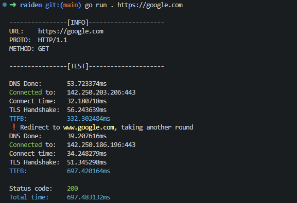

# Raiden

Raiden is a simple HTTP(S) client that traces the request lifecycle, providing detailed timing information for each phase of the request. It helps you analyze the performance of your HTTP requests by showing DNS lookup times, connection times, TLS handshake times, and more.

## Features

- Detailed timing information for each phase of the HTTP request
- Option to display response headers
- Handles HTTP redirects

## Installation

To install Raiden, you need to have Go installed on your machine. You can download and install Go from [the official website](https://golang.org/dl/).

Clone the repository and build the application:

```sh
git clone https://github.com/yourusername/raiden.git
cd raiden
go build -o raiden
```

## Using Flox Environments

To set up and use Flox environments for this project, follow these steps:

1. Ensure you have Flox installed. You can download and install Flox from [the official website](https://flox.dev/).

2. Activate the Flox environment:

```sh
flox activate
```

3. Install Go dependencies:

```sh
go get .
```

4. Build the application:

```sh
go build -o raiden
```

## Example usage

```sh
./raiden https://google.com
```


## License

This project is licensed under the MIT License. See the [LICENSE](LICENSE) file for details.